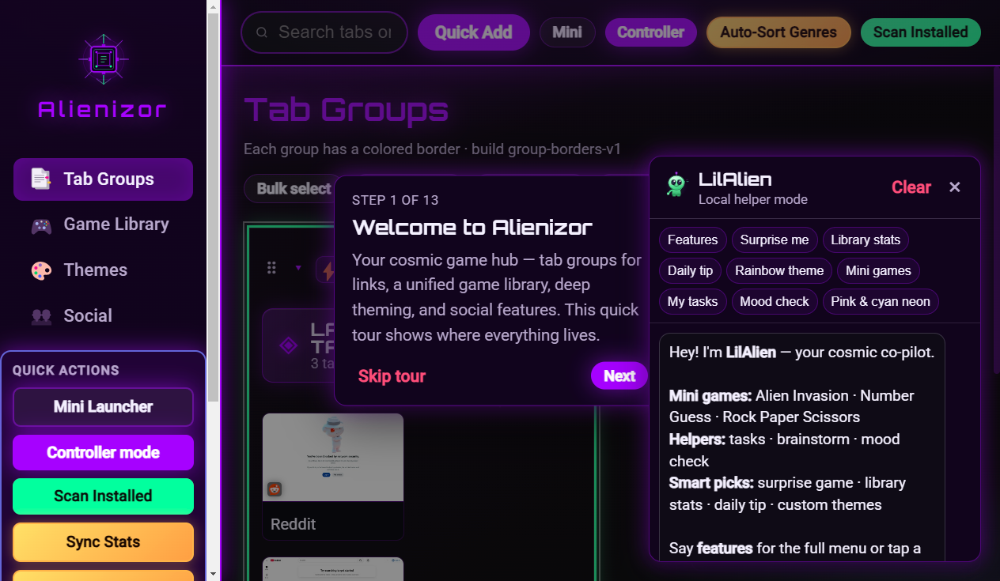
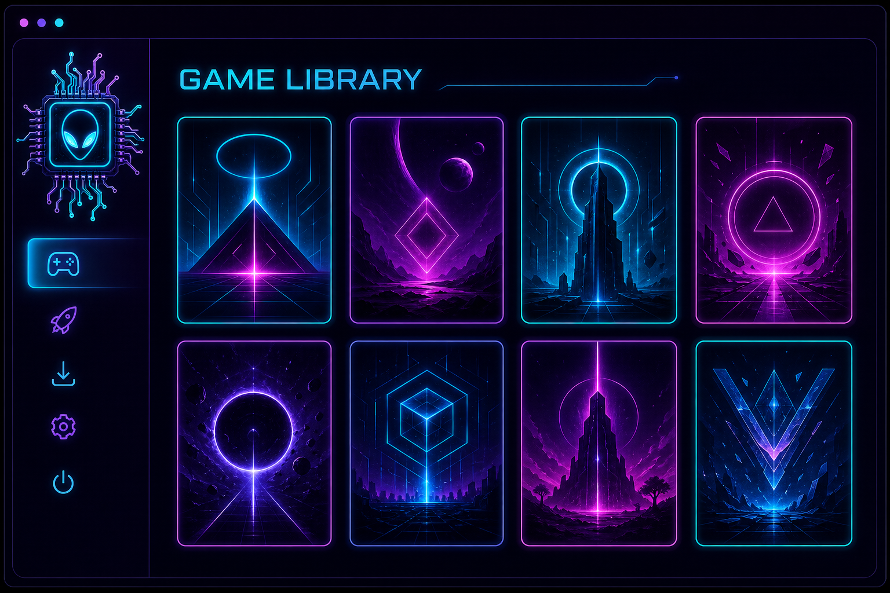
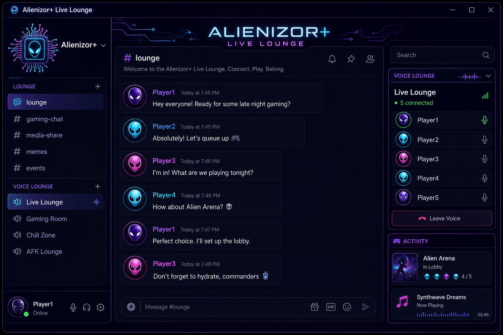

# Alienizor+

  

Alien-themed game browser and launcher for Windows — library, Live Lounge, friends, voice, and Discord Rich Presence.

## Pictures

  

  
  &nbsp;
  

More on the [download site](https://alienk1ng.github.io/MyGameBrowser-App/#screenshots).

## Install (Chrome / any browser)

**Download page (recommended):**  
https://alienk1ng.github.io/MyGameBrowser-App/

**Direct Windows Setup (v1.1.0):**  
https://github.com/ALIENK1NG/MyGameBrowser-App/releases/download/v1.1.0/alienizor-plus-setup-1.1.0.exe

**All releases:**  
https://github.com/ALIENK1NG/MyGameBrowser-App/releases/latest

### Chrome note

Chrome may warn that the file is uncommon (the app is not code-signed yet). That is normal for indie apps:

1. Click the download arrow / menu on the file  
2. Choose **Keep** → **Keep anyway**  
3. Run the Setup installer  

Then open **Alienizor+** from the desktop or Start Menu shortcut.

## Portable builds

If you prefer not to install:

- [Portable `.exe`](https://github.com/ALIENK1NG/MyGameBrowser-App/releases/download/v1.1.0/alienizor-plus-portable-1.1.0.exe)
- [Portable `.zip`](https://github.com/ALIENK1NG/MyGameBrowser-App/releases/download/v1.1.0/alienizor-plus-1.1.0-windows-portable.zip)
